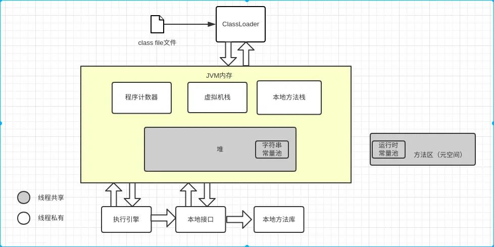

### 运行时数据划分





 `运行时常量池(Runtime Constant Pool)` 位于 `元数据空间 (Metaspace)`。当类加载到内存中后，Jvm 就会将 `Class常量池中` 的内容存放到 `运行时常量池中`。

Class 文件中的 `常量池表(Constant Pool Table)` 存放编译期生成的各种字面量和符号的引用。在类加载后 `常量池表(Constant Pool Table)` 的内容存放到 `运行时常量池`。

`字符串常量池` 位于 `堆 Heap`。


### Jvm 参数

```txt
//常见参数
-Xms1024m 初始堆大小 
-Xmx1024m 最大堆大小  一般将xms和xmx设置为相同大小，防止堆扩展，影响性能。
-Xss 设置虚拟机栈的大小
-Xmn 设置年轻代大小
-XX:NewRatio=n 设置年轻代和年老代的比值。n 为3,表示年轻代与年老代比值为1:3
-XX:SurvivorRatio=n 年轻代中Eden区与一个Survivor区的比值。n 为 8，标识eden:s0:s1=8:1:1
-XX:+HeapDumpOnOutOfMemoryError OOM时自动保存堆文件


-XX:+UseParallelGC:设置并行收集器 
-XX:+UseParalledlOldGC:设置并行年老代收集器 
-XX:+UseConcMarkSweepGC:设置并发收集器

//垃圾回收统计信息 
-XX:+PrintGC 
-XX:+PrintGCDetails 
-XX:+PrintGCTimeStamps 
```

```bash
java -jar -server -XX:MetaspaceSize=128m -XX:MaxMetaspaceSize=128m -Xms1024m -Xmx1024m -Xmn256m -Xss512k -XX:SurvivorRatio=8 -XX:+UseConcMarkSweepGC newframe-1.0.0.jar
```


```txt
-XX:-UseParallelGC
-XX:-UseParallelOldGC
-XX:-HeapDumpOnOutOfMemoryError
-XX:-PrintGCDetails
-XX:-PrintGCTimeStamps

// 查看所有默认 jvm 参数
java -XX:+PrintFlagsFinal -version

// 查看 JVM 正在使用的参数
java -XX:+PrintCommandLineFlags -version

// 设置
-XX:HeapDumpPath=./dump/oom.dump

// 初始堆大小
-Xms20m

// 最大堆大小
-Xmx20m

// 新生代大小(默认为堆的三分之一)
-Xmn 20m

// 老年代/新生代
XX:NewRatio=2


// eden/survivor
-XX:SurvivorRatio=8

// 跟踪类加载
-XX:+TraceClassLoading

// 日志位置
-Xloggc:log/gc.log
```

#### 查看默认参数

```powershell

# 查看所有默认 jvm 参数
java -XX:+PrintFlagsFinal -version

# 查看 JVM 正在使用哪个 GC
java -XX:+PrintCommandLineFlags -version

# 查看 GC 详细信息
java -XX:+PrintGCDetails -version
```

### 类从加载到虚拟机内存到卸载，整个生命周期
`加载`-> `验证`->`准备`->`解析`-> `初始化`->`使用`->`卸载`
### Gc 工具
```text
[Gc 日志分析 GCViewer](https://github.com/chewiebug/GCViewer)
Jvisualvm
jmc
```

虚拟机没有进行强制约束类的加载时机，对初始化阶段进行了限定

- 遇到 new ,getstatic,putstatic或invokestatic，类没有发生初始化，先触发初始化。
- 通过反射对类进行调用，类没有发生初始化，先触发初始化。
- 初始化一个类，发现父类没有初始化，先初始化父类
- 执行的主类没有初始化，先初始化 主类

### 计算机基础

[计算机基础](./doc/linux.md)