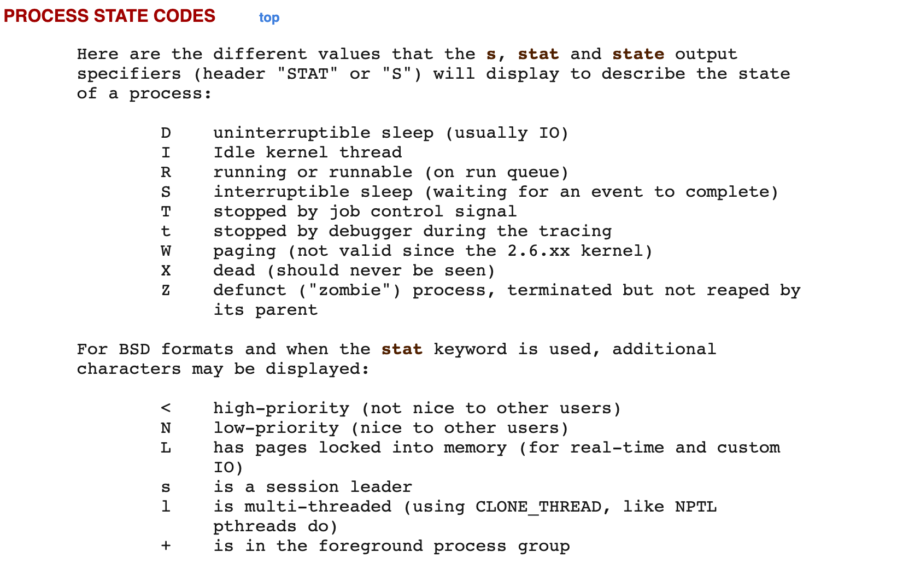

## 计算机概念

iowait 在内核采样周期内有未完成的 io 请求，一个或多个 cpu 空闲的时间百分比。

进程在等待特定的事件而进入睡眠，cpu 没有可执行的任务导致空闲。

- cpu 没有任务可以运行而空闲
- 进程等待 io 完成


### Cpu

一个机器可能包含多块 cpu，多个 cpu 通过系统总线通信。

一个 cpu 可能包含多个物理核，每个物理核具备自己的（运算器，寄存器，L1,L2缓存等等）

超线程技术，可以让一个物理核单位时间内同时处理多个线程，变成了多个逻辑核。

cat /proc/cpuinfo 查看 cpu 信息

```txt
// 逻辑核编号         
processor	: 2
// CPU编号
physical id	: 0
// 所在 CPU 中有多少逻辑核
siblings	: 4
// CPU的物理核编号
core id		: 2
// 所在 CPU 有多少物理核
cpu cores	: 4
```


```bash
# 总物理核数 = CPU个数 X CPU的物理核数 
# 总逻辑CPU数 = CPU个数 X CPU物理核数 X 超线程数

# 查看 CPU 个数
cat /proc/cpuinfo| grep "physical id"| sort| uniq | wc -l

# 查看单个 cpu 中物理核
cat /proc/cpuinfo| grep "cpu cores"| uniq

# 查看逻辑总核数
cat /proc/cpuinfo| grep "processor"| wc -l
```


在 Linux 系统下，使用 top 命令查看 CPU 使用情况，可以得到如下信息：

```
Cpu(s): 0.2%us, 0.1%sy, 0.0%ni, 77.5%id, 2.1%wa, 0.0%hi, 0.0%si, 20.0%st
```

- us(user)：表示 CPU 在用户态运行的时间百分比，通常用户态 CPU 高表示有应用程序比较繁忙。典型的用户态程序包括：数据库、Web 服务器等。
- sy(sys)：表示 CPU 在内核态运行的时间百分比（不包括中断），通常内核态 CPU 越低越好，否则表示系统存在某些瓶颈。
- ni(nice)：表示用 nice 修正进程优先级的用户态进程执行的 CPU 时间。nice 是一个进程优先级的修正值，如果进程通过它修改了优先级，则会单独统计 CPU 开销。
- id(idle)：表示 CPU 处于空闲态的时间占比，此时，CPU 会执行一个特定的虚拟进程，名为 System Idle Process。
- wa(iowait)：表示 CPU 在等待 I/O 操作完成所花费的时间，通常该指标越低越好，否则表示 I/O 存在瓶颈，可以用 iostat 等命令做进一步分析。
- hi(hardirq)：表示 CPU 处理硬中断所花费的时间。硬中断是由外设硬件（如键盘控制器、硬件传感器等）发出的，需要有中断控制器参与，特点是快速执行。
- si(softirq)：表示 CPU 处理软中断所花费的时间。软中断是由软件程序（如网络收发、定时调度等）发出的中断信号，特点是延迟执行。
- st(steal)：表示 CPU 被其他虚拟机占用的时间，仅出现在多虚拟机场景。如果该指标过高，可以检查下宿主机或其他虚拟机是否异常。

根据经验法则， 建议生产系统的 CPU 总使用率不要超过 70%。


当平均负载持续大于 0.7 * CPU 逻辑核数，就需要开始调查原因，防止系统恶化；


### linux 进程状态说明




#### R (TASK_RUNNING)，可执行状态

此状态的进程，会放到 cpu 的可进行队列中，进程调度器会从各个 cpu 的可进行队列中选择一个进程在该 cpu 上执行。此状态的进程可能已经得到 cpu 的使用权，也可能再等待 cpu 的使用权。


#### S (TASK_INTERRUPTIBLE)，可中断的睡眠状态

该状态下的进程，等待某事件的完成，而被挂起。


#### D (TASK_UNINTERRUPTIBLE)，不可中断的睡眠状态

等待内核完成一些操作，不能被打断，等待某些资源(网络 io 或者磁盘 io)。比如对磁盘的读写。处于这个状态的进程不能被 `kill -9`


### 平均负载

```txt
System load averages is the average number of processes that are
either in a runnable or uninterruptable state.  A process in a
runnable state is either using the CPU or waiting to use the CPU.  A
process in uninterruptable state is waiting for some I/O access, eg
waiting for disk.  
```

在两核系统下，平均负载为 2 时代表 cpu 被完全占用。

在四核系统下，平均负载为 4 时代表 cpu 被完全占用。

在过去的 1min,5min,15min 平均负载。

平均负载高于 cpu 数量的 70% 需要排查分析问题。


平均负载和 cpu 使用率没有直接关系。

平均负载是指正在使用 cpu 和 等待 cpu/等待 io 的进程。

安装一些工具模拟环境及定位问题

```bash
yum install stress-ng 
```

```bash
git clone git://github.com/sysstat/sysstat
cd sysstat
./configure
make install
```


- cpu 密集计算，平均负载升高，cpu 使用率也高。

```bash
# 模拟 CPU 密集计算
stress-ng -c 4 --timeout 600
```

- io 密集型，等待 io 导致平均负载升高，而 cpu 使用率不高。

```bash
# --hdd表示读写临时文件，模拟 io 密集
stress-ng -i 1 --hdd 1 --timeout 600
```

- 大量等待 cpu 调度，导致平均负载升高，cpu 使用率也高。

```bash

```


stress-ng 是系统压力测试工具。sysstat 是系统分析工具。

- mpstat 是多核 CPU 性能分析工具，用来实时查看每个 CPU 的性能指标，以及所有CPU的平均指标。

```bash
# 监控每个 cpu 的状态
mpstat -P ALL 2 5
```

- pidstat 是一个常用的进程性能分析工具，用来实时查看进程的 CPU、内存、I/O 以及上下文切换等性能指标。

```bash
# 监控 io,3秒间隔，输出 5 次
pidstat -d 3 5

# 监控 cpu ,3秒间隔，输出 6 次
pidstat -u 3 6

# 监控 cpu 切换，3秒间隔，输出 7 次
pidstat -u 3 7
```


## 计算机术语

硬中断和软中断。

网络 io 来了，会向内核发送软中断信号，让内核来处理。

进程和线程。进程是系统资源分配的最小单元。线程是系统调度的最小单元。

### 内存管理

内存管理系统：虚拟地址 分页装入 软硬件结合寻址

1. 分页（内存不够用），内存中分成固定大小的页框（4K），把程序（硬盘上）分成4K大小的块，用到哪一块，加载那一块，加载的过程中，如果内存已经满了，会把最不常用的一块放到swap分区， 把最新的一块加载进来，这个就是著名的LRU算法
2. 虚拟内存（解决相互打扰问题）
    1. DOS Win31 ... 互相干掉
    2. 为了保证互不影响 - 让进程工作在虚拟空间，程序中用到的空间地址不再是直接的物理地址，而是虚拟的地址，这样，A进程永远不可能访问到B进程的空间
    3. 虚拟空间多大呢？寻址空间 - 64位系统 2 ^ 64，比物理空间大很多 ，单位是byte
    4. 站在虚拟的角度，进程是独享整个系统 + CPU
    5. 内存映射：偏移量 + 段的基地址 = 线性地址 （虚拟空间）
    6. 线性地址通过 OS + MMU（硬件 Memory Management Unit）
3. 缺页中断（不是很重要）：
    1. 需要用到页面内存中没有，产生缺页异常（中断），由内核处理并加载


### 磁盘

linux 采用虚拟文件系统(VFS)。需要将分区挂载到虚拟文件系统中的一个挂载点（虚拟文件系统的一个路径）。


### 查看 tcp 链接状态

```bash
netstat -ant | awk '/^tcp/ {print $6}' | sort |uniq -c
```


## 性能监控

### 监控 cpu

- top
- mpstat

```bash
# -P 指定监控那个 cpu ,1 代表 1 秒间隔，10 代表监控次数
mpstat -P 0 1 10
```

### 监控内存

vastat

```bash
# 每秒打印一次，共打印 10 次
vmstat 1 10 
```

free

```bash
# 查看内存使用情况
free -h
```

### 监控网络

netstat

```bash
# 查看网卡发送和接受的数据
netstat -i 

# 查看监控信息
netstat -natp
```

tcpdump 抓包

```bash
# 对 80 端口进行抓包
tcpdump -nn -i eth0 port 80
```

traceroute 查看路由转发

```bash
traceroute www.baidu.com
```


arp -a

查看网关关联的 mac 地址

```bash
# 监控
arp -d 10.211.55.2 && curl www.baidu.com
# 监控抓包
tcpdump -nn -i eth0 port 80 or arp
```


### 监控磁盘

```bash
# 监控间隔 1s ,监控 5 次 
iostat -x 1 5
```

说到磁盘性能的衡量标准，必须要提到五个常见指标，也就是我们经常用到的，使用率、饱和度、IOPS、吞吐量以及响应时间等。这五个指标，是衡量磁盘性能的基本指标。

- 使用率，是指磁盘处理I/O的时间百分比。过高的使用率（比如超过80%），通常意味着磁盘 I/O 存在性能瓶颈。
- 饱和度，是指磁盘处理 I/O 的繁忙程度。过高的饱和度，意味着磁盘存在严重的性能瓶颈。当饱和度为 100% 时，磁盘无法接受新的 I/O 请求。
- IOPS（Input/Output Per Second），是指每秒的 I/O 请求数。
- 吞吐量，是指每秒的 I/O 请求大小。
- 响应时间，是指 I/O 请求从发出到收到响应的间隔时间。

这些指标中，你要注意：

- %util ，就是我们前面提到的磁盘I/O使用率；
- r/s+ w/s ，就是 IOPS；
- rkB/s+wkB/s ，就是吞吐量；
- r_await+w_await ，就是响应时间。

在观测指标时，也别忘了结合请求的大小（ rareq-sz 和wareq-sz）一起分析。

查看进程的 io 情况

```bash
pidstat -d 1
```

查看进程打开了哪些文件

```bash
# 根据 进程 id 查看文件打开情况
lsof -p 11
```


### 监控系统调用

```bash
# 追踪某个进程的系统调用
strace -ff -p
```

